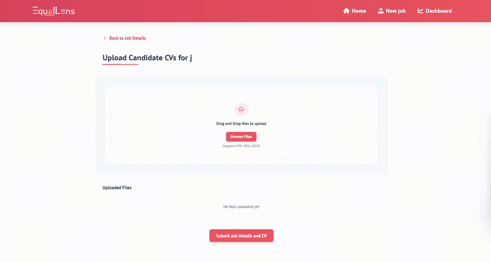

# EqualLens - AI-Powered Recruitment Platform

## Overview
This repository hosts the code and documentation for the EqualLens Project, an AI-powered hiring platform designed to promote fair and unbiased recruitment by anonymizing candidate information and evaluating applicants based on merit. Built with React and FastAPI, the platform integrates Google Cloud AI services, including Vision API, Document AI, Natural Language API, and Gemini API, to extract, analyze, and rank candidate resumes objectively. The platform also automates email notifications, schedules interviews, and conducts AI-driven interviews with facial verification, speech-to-text transcription, and voice anonymization.

## Team Members
1. Lim Hong Yu
2. Ooi Rui Zhe
3. Khor Rui Zhe
4. Vanness Liu Chuen Wei

EqualLens is a comprehensive recruitment platform that leverages Google's AI technologies to create a fairer, more efficient hiring process. The platform automates resume analysis, candidate ranking, and interviewing, while ensuring bias reduction through anonymized screening.


## 📋 Table of Contents

- [Introduction](#introduction)
- [Key Features](#key-features)
- [Google Technologies Used](#google-technologies-used)
- [System Architecture](#system-architecture)
- [Installation & Setup](#installation--setup)
- [Key Workflows](#key-workflows)
- [Screenshots](#screenshots)
- [Future Roadmap](#future-roadmap)
- [Contributing](#contributing)
- [License](#license)

## 🔍 Introduction
EqualLens is an AI-powered hiring platform designed to eliminate bias and discrimination in recruitment processes. Leveraging Google Cloud AI services and enforcing anonymity, our platform facilitates fair and objective evaluation of candidates based solely on merit. The system addresses employment discrimination issues prevalent in many workplaces, particularly in countries like Malaysia where racial, religious, gender, and age biases can significantly impact hiring decisions.

## ✨ Key Features

### Resume Management
- **Bulk CV Upload**: Upload multiple resumes at once for a job position
- **Document Parsing**: Extract structured information from PDF/DOCX resumes
- **Data Organization**: Automatic organization of candidate data by job position

### Anonymized Candidate Screening
- **Bias Reduction**: Initial screening without revealing candidate names, photos, gender, or race
- **AI-Powered Analysis**: Automated extraction of skills, experience, and education
- **Customizable Ranking**: Configurable weighting system for different criteria (experience, skills, education)

### AI-Driven Candidate Ranking
- **Scoring Engine**: Algorithmic ranking based on job requirements 
- **Customizable Weights**: Adjust importance of different factors using natural language prompts
- **Visual Results**: Clear visualization of candidate scores and rankings

### Automated Interview System
- **Dynamic Question Generation**: AI-generated interview questions based on job requirements and candidate resumes
- **Self-Service Interviews**: Candidates can complete interviews remotely on their own schedule
- **Identity Verification**: Secure verification using face comparison with ID documents
- **Video Recording**: Automatic recording and secure storage of interview responses

### Interview Review and Management
- **Centralized Dashboard**: Single view of all candidates and their progress
- **Video Playback**: Review recorded interview responses with transcripts
- **Feedback System**: Rate and comment on candidate responses
- **Automated Emails**: Send interview invitations and rejections with templated emails

## 🚀 Google Technologies Used

EqualLens leverages multiple Google Cloud services for its AI capabilities:

### Document Processing
- **Google Document AI**: Extracts structured text and information from resumes (PDF/DOCX)
- **Google Natural Language API**: Analyzes extracted text to identify skills, experience, and education

### Candidate Analysis
- **Google Generative AI (Gemini)**: Powers the customizable ranking system and interview question generation
- **Natural Language API**: Performs linguistic analysis of interview responses based on confidence, clarity, relevance, and engagement

### Identity Verification
- **Google Cloud Vision API**: Performs face detection and verification when comparing ID photos with video

### Speech & Audio Processing
- **Google Cloud Speech-to-Text API**: Transcribes interview responses with domain-specific boosts and automatic punctuation

### Infrastructure & Integration
- **Firebase Firestore**: Unstructured database for storing candidate, job, and application data
- **Firebase Cloud Storage**: Stores resumes, videos, and processed audio with CDN for global performance


## 🏗️ System Architecture

The EqualLens platform consists of several interconnected components:

### Frontend
- **React-based SPA**: Modern, responsive UI built with React
- **Component-based Design**: Modular architecture for maintainability
- **Custom Visualization Components**: Interactive performance metrics charts and animated progress indicators

### Backend
- **Python FastAPI**: High-performance API with three-layer architecture:
  - API routers for endpoint functionality
  - Service layer for business logic
  - Model layer for schema definitions
- **Firebase Integration**: Direct interaction with Firestore and Storage
- **Google API Clients**: Interfaces with various Google Cloud services

### Database Design
- **Collections Structure**:
  - `jobs`: Job listings and requirements
  - `candidates`: Candidate information and extracted resume data
  - `applications`: Links between candidates and jobs with application status tracking
  - `interviewQuestionSet`:  Interview question templates organized by job category
  - `interviewQuestionActual`: Specific questions presented to candidates with timestamps
  - `interviewResponses`: Recorded video responses with scoring data and metadata
  - `interviewLinks`: Secure interview access links with expiration dates and verification status
  - `emailNotifications`: Records of all communications sent to candidates with delivery status

## 💻 Installation & Setup

### Prerequisites
- Node.js (v16+)
- Python (v3.8+)
- Firebase account
- Google Cloud Platform account with the following APIs enabled:
  - Document AI
  - Natural Language
  - Cloud Vision
  - Speech-to-Text
  - Generative AI Studio (Gemini)

### Backend Setup
1. Clone the repository
```bash
git clone https://github.com/your-org/equallens.git
cd equallens/backend
```

2. Create a virtual environment and install dependencies
```bash
python -m venv venv
source venv/bin/activate  # On Windows: venv\Scripts\activate
pip install -r requirements.txt
```

3. Set up Firebase credentials
```bash
# Create a firebase_config.json file with your Firebase service account key
touch firebase_config.json
# Add your Firebase configuration
```

4. Configure environment variables
```bash
# Create .env file
touch .env

# Add the following variables to .env
DOCUMENTAI_PROJECT_ID=your-project-id
DOCUMENTAI_LOCATION=us
DOCUMENTAI_PROCESSOR_ID=your-processor-id
DOCUMENTAI_PROCESSOR_VERSION=your-processor-version
GEMINI_API_KEY=your-gemini-api-key
FIREBASE_STORAGE_BUCKET=your-storage-bucket
SMTP_SERVER=smtp.gmail.com
SMTP_PORT=587
SMTP_USERNAME=your-email@gmail.com
SMTP_PASSWORD=your-app-password
```

5. Start the backend server
```bash
uvicorn main:app --reload
```

### Frontend Setup
1. Navigate to the frontend directory
```bash
cd ../frontend
```

2. Install dependencies
```bash
npm install
```

3. Configure environment variables
```bash
# Create .env file
touch .env

# Add the following variables
REACT_APP_API_URL=http://localhost:8000
REACT_APP_FIREBASE_API_KEY=your-firebase-api-key
REACT_APP_FIREBASE_AUTH_DOMAIN=your-firebase-auth-domain
REACT_APP_FIREBASE_PROJECT_ID=your-firebase-project-id
REACT_APP_FIREBASE_STORAGE_BUCKET=your-firebase-storage-bucket
REACT_APP_FIREBASE_MESSAGING_SENDER_ID=your-firebase-messaging-sender-id
REACT_APP_FIREBASE_APP_ID=your-firebase-app-id
```

4. Start the frontend development server
```bash
npm start
```

## 🔄 Key Workflows

### 1. Job Creation & Resume Upload
1. HR creates new job listings with title, description, and requirements
2. HR uploads multiple resumes in bulk through the dashboard interface
3. AI-powered document parsing extracts and structures resume data automatically
4. System categorizes candidates under appropriate job positions
5. HR can upload additional resumes at any time
5. Candidate data is organized into structured profiles for efficient comparison

### 2. Anonymized Candidate Screening
1. HR views candidate list with identifying information removed to reduce bias
2. System presents anonymized profiles with structured skill, experience, and education breakdown
3. AI analysis highlights qualifications without revealing demographic information
4. HR evaluates candidates based on objective criteria rather than personal factors
5. Screening process ensures consistent and fair evaluation across all applications

### 3. AI-Driven Candidate Scoring & Ranking
1. HR selects from three predetermined ranking criteria: skills, education, and experience
2. System applies numerical weights to each selected criterion for consistent evaluation
3. AI scores candidates based on resume match to job requirements using selected criteria
4. HR can quickly adjust ranking priorities to see different candidate orderings
5. Visual score breakdowns show each candidate's performance across all criteria
6. HR can approve candidates to proceed directly to the interview stage

### 4. AI-Tailored Interview Questions with Manual Control
1. HR uses "AI Generate Sections" to create complete question sets tailored to individual candidates or job requirements
2. Generated questions are automatically organized into relevant sections (Technical Skills, Work Experience, etc.)
3. System offers flexibility with randomized selection, compulsory questions, and customizable time limits
4. HR can edit any AI-generated questions or add manual questions before finalizing
5. "Apply to All" feature allows consistent question sets to be deployed across multiple candidates
6. Individual questions can be AI-generated within sections for targeted assessment of specific candidate attributes

### 5. Automated Interview Process
1. System sends personalized interview invitations with secure one-time links that expire after 7 days
2. Candidates verify identity through live photo comparison with ID
3. Interface presents questions sequentially with a 20-second reading period before recording begins
4. Candidates record responses with facecam in a single-attempt format with predetermined time limits
5. Self-service scheduling allows candidates to complete interviews at their convenience within the link's validity period
6. Responses are automatically processed with Google Cloud Speech-to-Text for consistent evaluation across all applicants

### 6. Interview Review & Analysis
1. HR reviews candidates through an interactive dashboard with status tracking and advanced filtering options.
2. The system displays candidate audio responses with synchronized transcript highlighting, enabling efficient review.
3. AI analyzes responses across four key metrics: relevance, clarity, confidence, and engagement, with detailed score breakdowns for each.
4. Performance data is presented through visual charts showing grade assessments, score composition, and achievement percentages.
5. AI generates objective feedback for each response with specific improvement suggestions, highlighting strengths and weaknesses.
6. HR can send personalized offer or rejection emails directly through the platform.

## 📸 Screenshots
Bulk CV Upload and Management


Seamless Document Parsing


AI-Driven Candidate Ranking


AI-Tailored Interview Questions with Manual Control


## 🔮 Future Roadmap
- **Accessibility Features**: Sign language recognition for candidates with speech impairments using Google Video Intelligence API and MediaPipe
- **Advanced Facial Analysis**: Engagement assessment through expression detection with Google Cloud Video Intelligence API while maintaining anonymity
- **Animated Avatars**: Using Vertex AI to create anonymized avatars that mirror facial expressions while masking identity
- **Predictive Analytics**: Historical data analysis with TensorFlow and scikit-learn to identify successful hire patterns
- **Personalized AI Chatbot**: Assistant for recruiters with candidate recommendations using Gemini and Dialogflow
- **ATS Integration**: Seamless connection with existing Applicant Tracking Systems
- **Multi-language Support**: Expanded capabilities for global recruitment needs

## 🤝 Contributing
We welcome contributions to the EqualLens project! Please see our [Contributing Guidelines](CONTRIBUTING.md) for more information.

## 📄 License
This project is licensed under the MIT License - see the [LICENSE](LICENSE) file for details.
---

Built with ❤️ by the EqualLens Team
